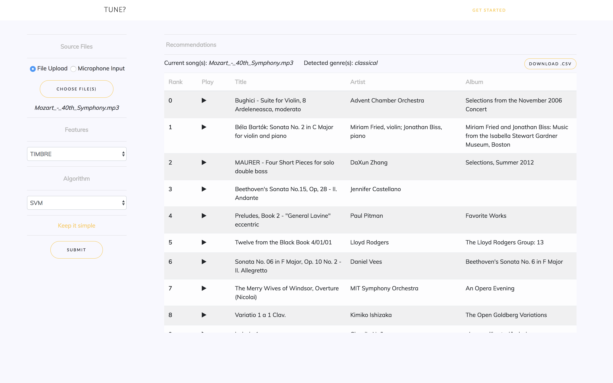

# Applying Machine Learning and Audio Analysis Techniques to Music Recommendation 
**Module:** CS310 Computer Science Project  
**Author:** Matthew Penny [1509819]  
**Supervisor:** Victor Sanchez  
**Department:** Department of Computer Science, University of Warwick, United Kingdom  
**Year:** 2018
  
This document will provide installation and usage instructions for the music recommendation system created for this project. More information on the background research, development, performance results, system evaluation undertaken during the creation of this system can be found in the accompanying report, along with proposed areas of future work.

## Prerequisites:
### Software Requirements
The application is created in [Python](https://www.python.org/downloads/) 2.7.14. In addition to the standard Python installation, the following libraries are required to be installed prior to using the system, many of which are included in the [Anaconda](https://www.anaconda.com/download/) distribution:

 - scikit-learn
 - NumPy
 - [LibROSA](https://librosa.github.io/)*
 - Matplotlib
 - SciPy
 - [Flask](http://flask.pocoo.org/)*
 - PyAudio

\* not included in Anaconda distribution.

[FFmpeg](https://ffmpeg.org/) is used to implement file format conversion, and may require additional codecs (libavcodec-extra-53) to be installed or enabled to handle MP3 files (GTZAN dataset). This can be performed by compiling it manually, through homebrew (macOS) or by the following command on Linux:
```
sudo apt-get install ffmpeg libavcodec-extra-53
```

### System Requirements
The system hardware requirements, including memory and storage, will vary depending on the size of the training dataset used.
A minimum of 8GB of memory is recommended, whilst approximately 70GB of available storage space is required. This storage capacity includes the dataset (MP3 and WAV formats), trained models and song data for a 10,000 song subset of the FMA dataset (30 second samples)

## Installation & Basic Setup:
Firstly, save the project files to a new directory.  

Next, the `project_audio_dir` variable needs to be updated to point to the new location of the audio within the application.

Once the required software libraries have been installed in the Python environment, the feature extraction and model training can be performed by running the **setup.py** script, e.g. by:

    cd <path_to_project>
    python setup.py

`<path_to_project>` should be replaced by the actual directory of the project code.
This script performs feature extraction from the audio directory defined in **paths.py**, creating a `Song` object containing all the extracted data for each track, and trains the machine learning models using the data extracted from the training dataset. The song data and models are then saved to disk for later use.

Extracted song data and trained machine learning models are included on the provided USB, using the FMA dataset with restricted genres. However, the song data will still refer to the old file path unless re-trained, which will cause song previews to be unavailable. This subset of the FMA dataset is also included on the USB, although only in MP3 format due to the file size when converted WAV. This allows for retraining using the same dataset, although conversion and feature extraction will also have to be repeated to create the WAV files and update the file paths for song previews. Depending on the size of the dataset, feature extraction and model training may take a number of hours to complete.

The server can be started, including the loading of the required data files, by running **server.py**, e.g.:

    python server.py

## Usage:
The application can be accessed once the server is running and the song data and model files have loaded. For localhost, it can be accessed at IP: `127.0.0.1:5000`. If the application were to be deployed, the system administrator would perform the server setup steps detailed in *Installation and Basic Setup*, with users then able to access the hosted system via the internet.

The user interface was designed to be simple to use. Recommendations can be retrieved by selecting the input method (file upload or microphone input). Advanced features, offering the option to select the feature vector format and machine learning model to use, can be displayed by clicking 'Under the hood'. A screen capture of this form and the table of returned results, providing information and previews for each song, can be seen below.

A video demo, showing the operation of the system is also included (`demo.mov`).



## Tips:

 - Preprocessing scripts are included to select valid training songs in
   a standardised format from both the FMA and GTZAN datasets.
 - If more models are added, these need to be included in the dictionary created in **initialise.py**.
 - MFCC spectrograms can be created using the **mfcc_plot.py** script.
 - Recommendation can be performed without the UI, by running **recommender.py** directly to obtain a list of textual information detailing information about the recommended songs: 
 `python recommender <path_to_music> <recommendation_mode> <vector_type> <data>`
 - The directories used for audio data can be easily updated by modifying the paths in **paths.py**. If new directories are assigned, they must already exist before running the system.
